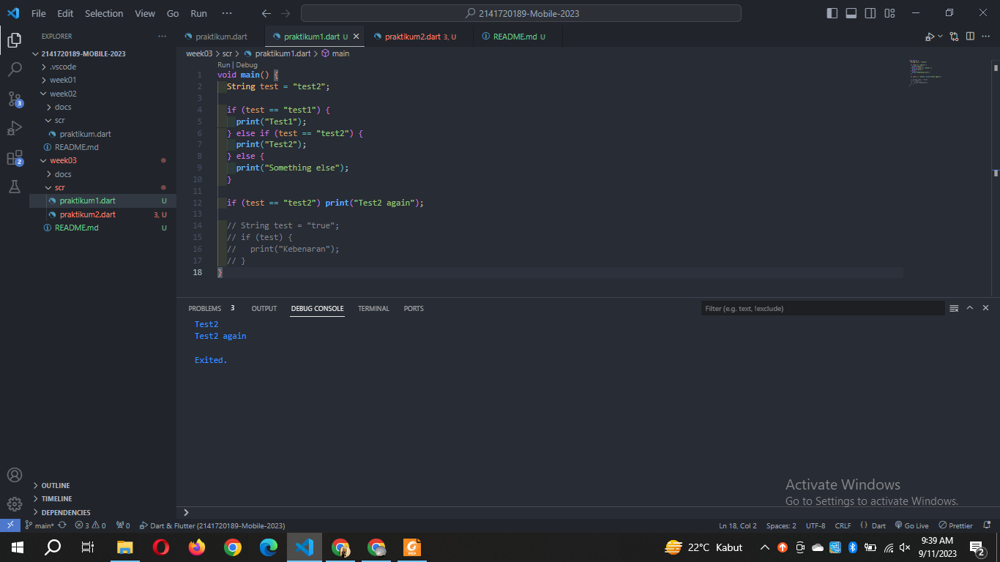
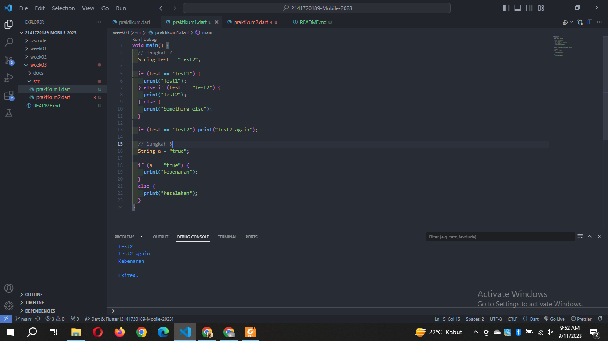
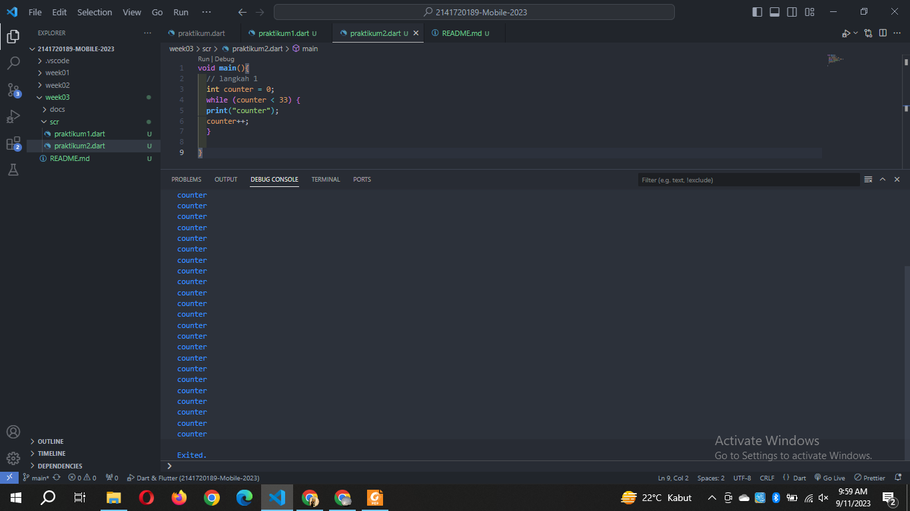
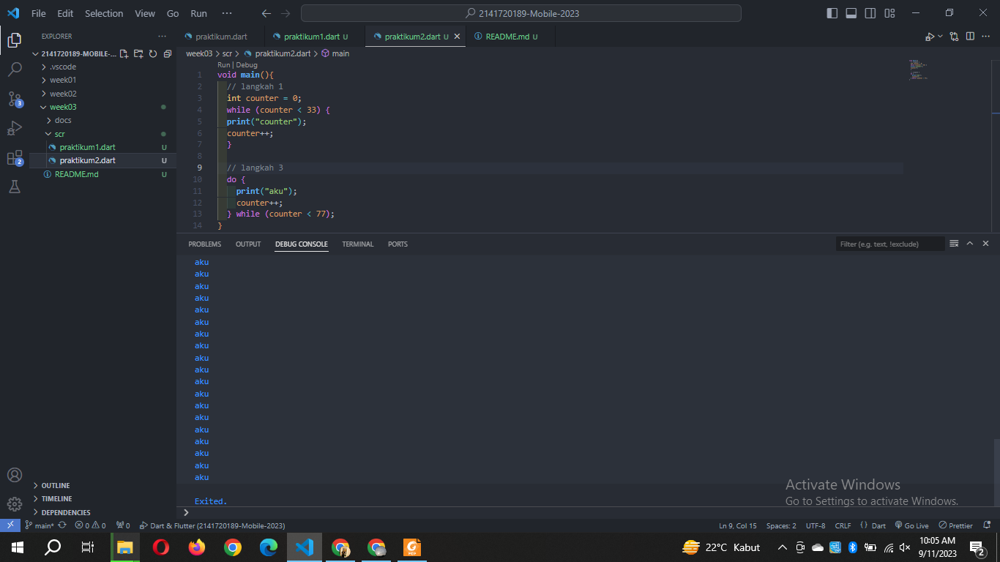
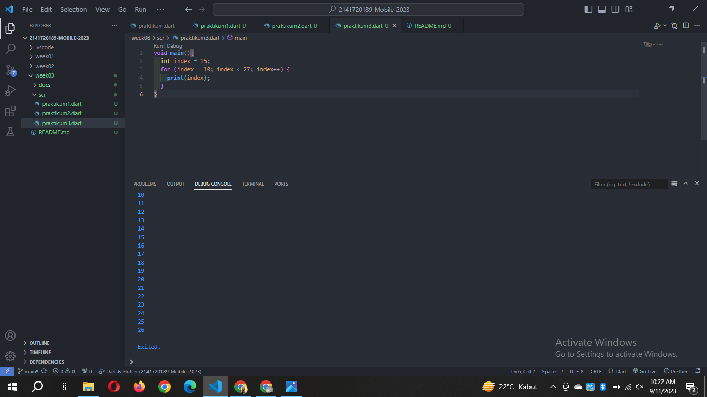
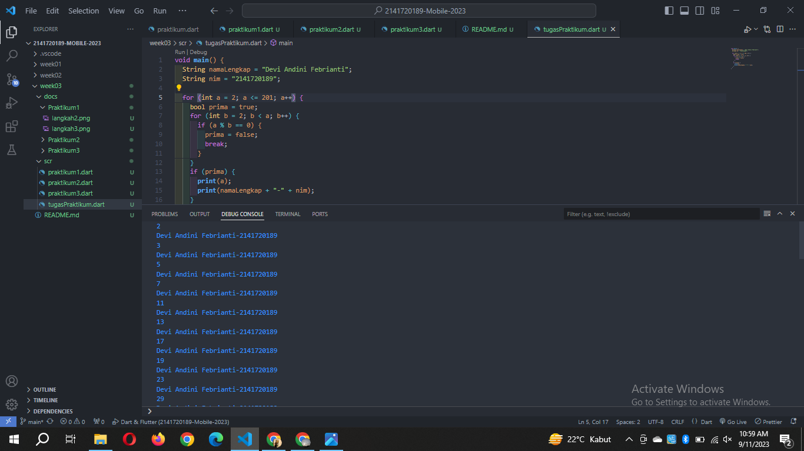

- **Nama:** Devi Andini Febrianti
- **NIM:** 2141720189
- **Kelas:** TI-3H
- **No Absen:** 09

# Praktikum 1: Menerapkan Control Flows ("if/else")
- Langkah 2 

Pada langkah ini di if else yang pertama akan menampilkan input berupa "Test2" karena if yang pertama tidak terpenuhi dan mengeksekusi else if yang kedua sehingga mencetak Test2. Sedangkan if yang bawah juga terpenuhi sehingga menyebabkan print "Test2 again".

- Langkah 3 

Dokumentasi ini sudah dibenarkan menjadi tidak error

Terjadi error karena adanya duplikat nama sesuai dengan yang atas, maka dimodifikasi seperti dokumentasi dan menghasilkan output "Kebenaran".

# Praktikum 2: Menerapkan Perulangan "while" dan "do-while"
- Langkah 2

Langkah ini terjadi error karena belum dideklarasikan terlebih dahulu nilainya.

- Langkah 3

Tidak terjadi error, namun saya ubah print("aku") untuk membedakan apakah terjadi error ataukah tidak.

# Praktikum 3: Menerapkan Perulangan "for" dan "break-continue"

Program ini melalukan proses looping selama index kurang dari 27, namun looping tidak akan menambahkan variabel dan tidak akan berhenti ini yang dinamakan infinite loop. untuk perubahannya berada di file dokumentasi.

# TUGAS PRAKTIKUM
1. Silakan selesaikan Praktikum 1 sampai 3, lalu dokumentasikan berupa screenshot hasil pekerjaan beserta penjelasannya!
- Jawab: Semua dokumentasi ada di folder docs per praktikum.

2. Buatlah sebuah program yang dapat menampilkan bilangan prima dari angka 0 sampai 201 menggunakan Dart. Ketika bilangan prima ditemukan, maka tampilkan nama lengkap dan NIM Anda
- Jawab: 
- Penjelasannya: 
for pertama, Selama nilai a kurang dari atau sama dengan 201, perulangan akan terus dilakukan. Kemudian, perulangan nested for kedua digunakan untuk memeriksa nilai a merupakan bilangan prima atau bukan. Pada setiap  perulangan, jika nilai a habis dibagi dengan b, maka variabel prima akan diberikan nilai false dan perulangan nested for akan dihentikan menggunakan perintah break.
