# Nama: Devi Andini Febrianti
# No/Nim: 09/2141720189
# Kelas: 3H

TUGAS PRAKTIKUM

1. Silakan selesaikan Praktikum 1 sampai 5, lalu dokumentasikan berupa screenshot hasil pekerjaan Anda beserta penjelasannya!
- Praktikum 1:

'langkah1'
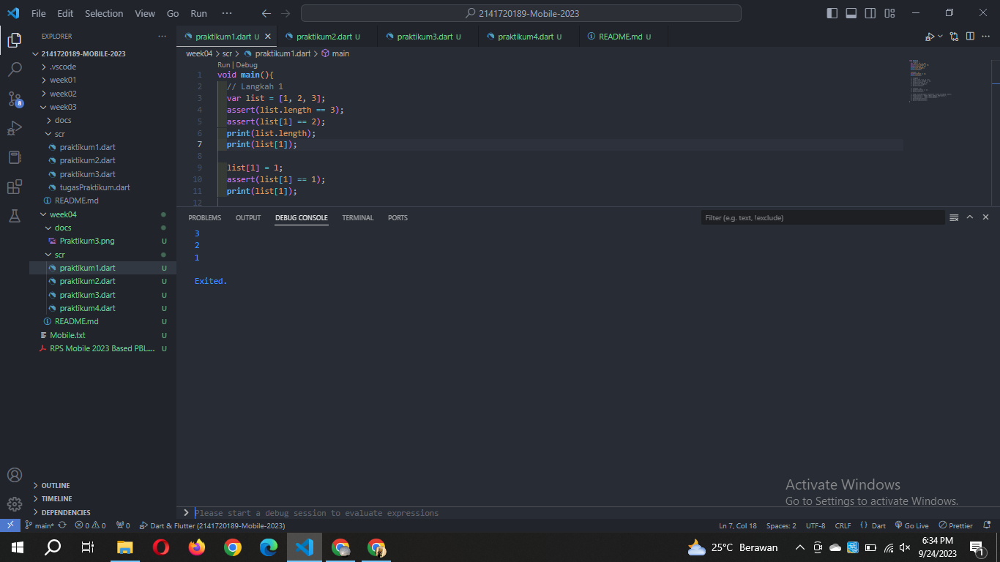

'langkah2'

Penjelasannya yaitu: kode ini berisi beberapa list untuk menyimpan angka. kode ini menggunakan "assert" digunakan untuk memeriksa kondisi tersebut benar atau salah.

'langkah 3'

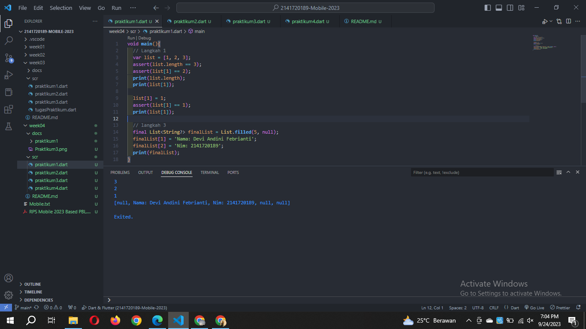
Penjelasan: List ini mempunyai panjang 5, indeks 1 & 2 diisi dengan nama dan nim yang membuat tidak null.

- Praktikum 2:

'langkah 1'
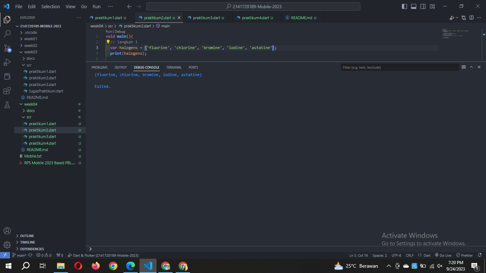

'langkah 2'
Penjelasan: pada kode ini variabel halogens diinisialisasi dan di print. Set adalah tipe data yang mengandung elemen-elemen unik, sehingga tidak ada duplikat dalam Set.

'langkah 3'

Output langkah 3
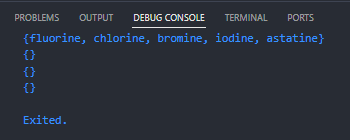

perbaikan dari langkah 3:
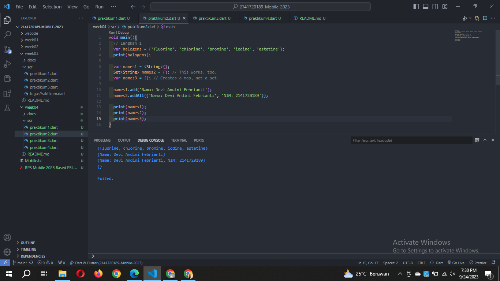

- Praktikum 3:

'langkah 1'
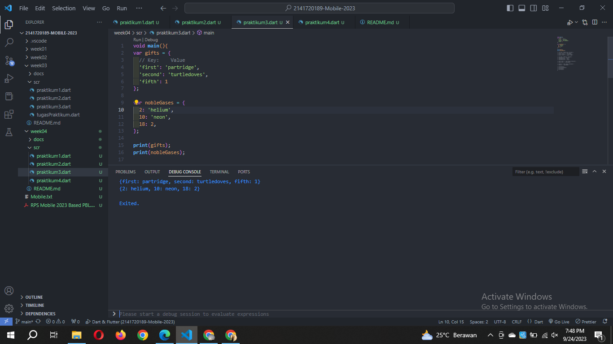

'langkah 2'
Penjelasan: Kode inimenjelaskan tentang Map yang memiliki tiga pasangan key-value dapat berupa tipe data String dan int.

'langkah 3'
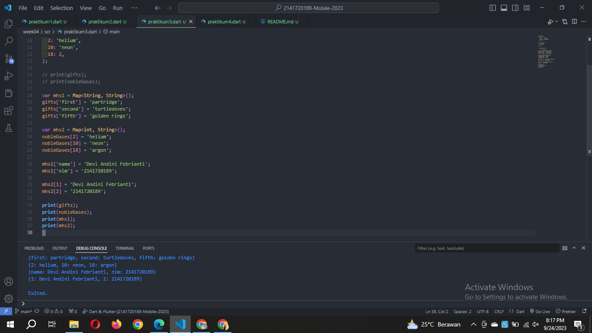

- Praktikum 4:

'langkah 1'

'langkah 2'
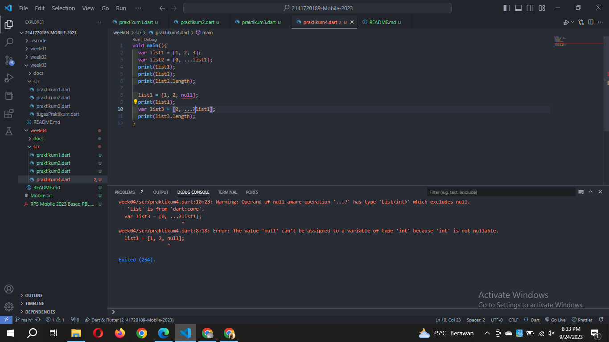
Terjadi error karena penulisan kode yang tidak sesuai.

'langkah 3'
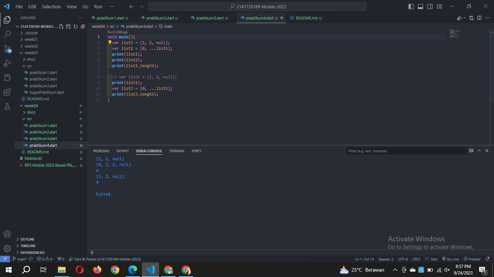
Terjadi error di null. maka diperbaiki seperti ini

'langkah 4'
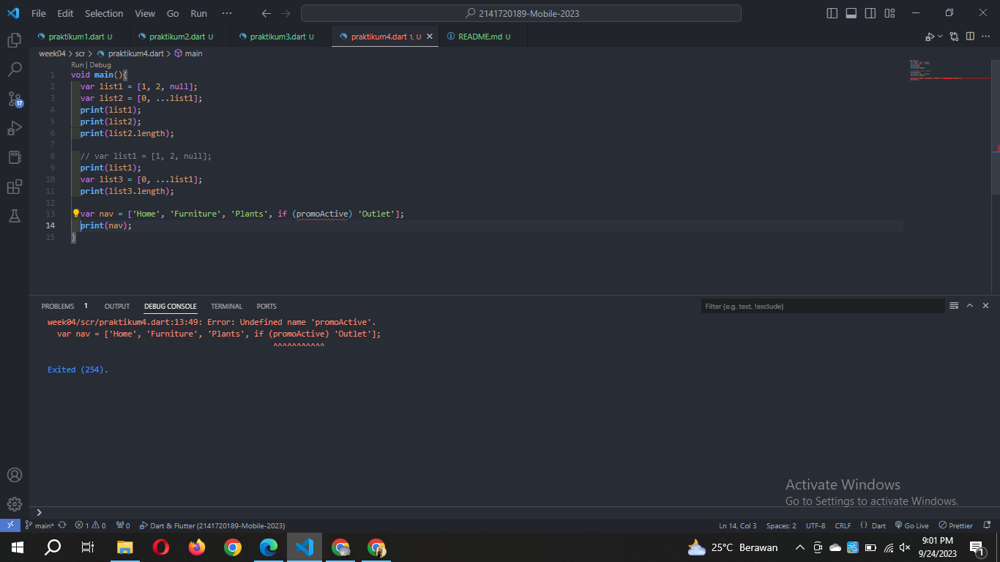
Terjadi error karena promoActive belom didefinisikan.
- promoActive true
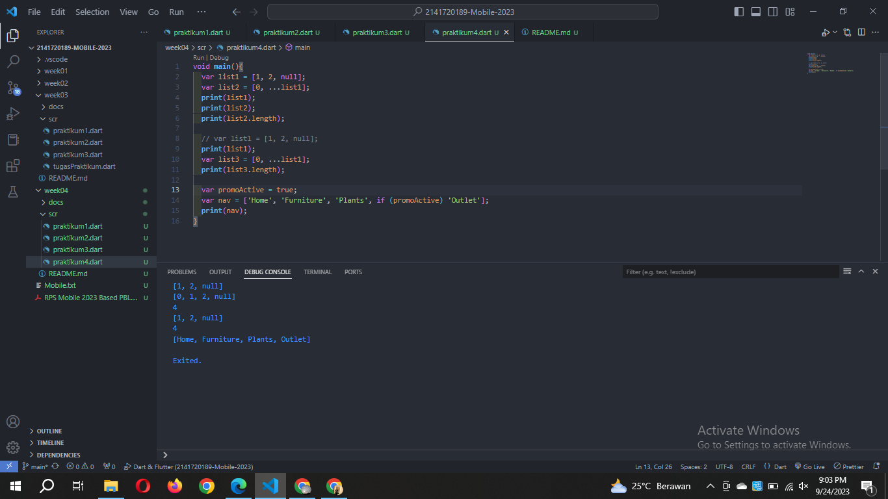
- promoActive false
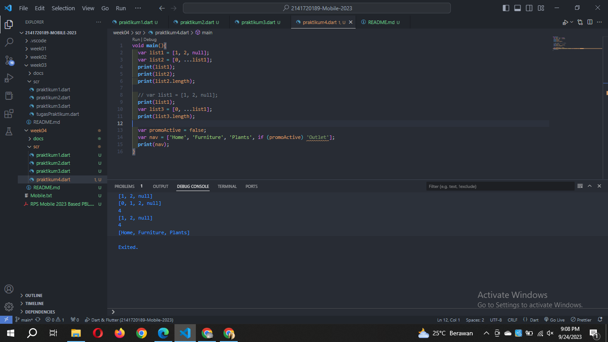

'langkah 5'
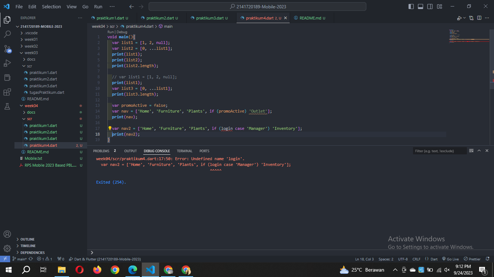
Terjadi error karena login belum diinisialisasi, maka perbaikannya seperti ini
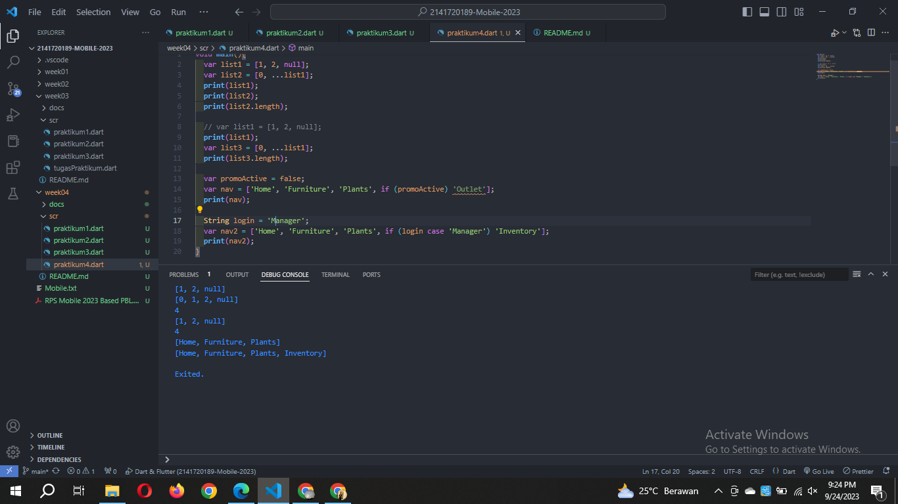

'langkah 6'
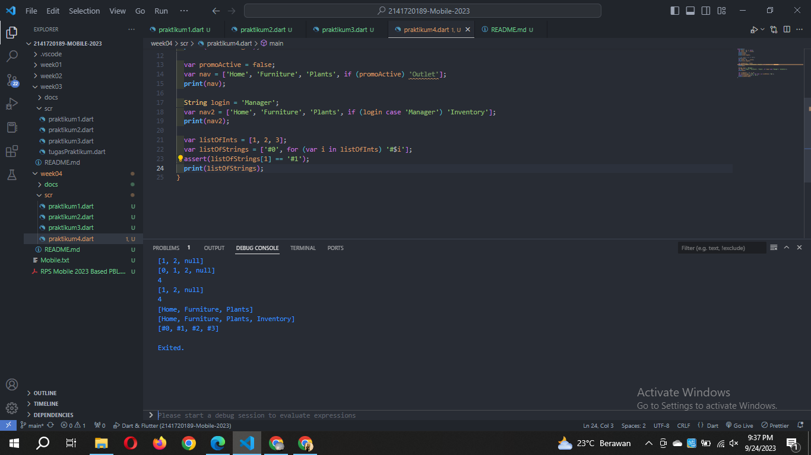
Kode ini digunakan untuk membuat List "listOfStrings" berisi string yang dihasilkan dan kemudian dicek elemen kedua dari List "listOfStrings" adalah "#1" dan menggabungkannya dengan tanda pagar (#).

- Praktikum 5:
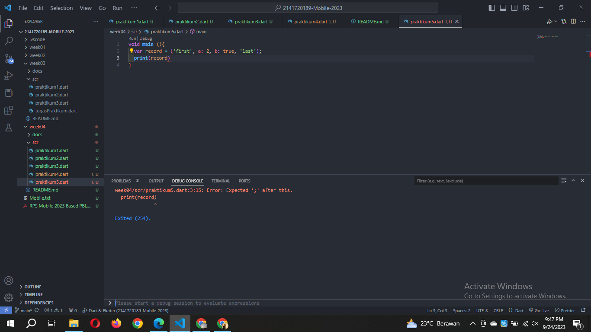
Terjadi error karena kurang ; diakhir kode

2. Jelaskan yang dimaksud Functions dalam bahasa Dart!
- Functions dalam dart digunakan untuk menjalankan tugas yang spesifik dalam program. Dapat di definisikan dengan memberikan nama, beberapa parameter dan tipe data yang dikembalikan. Fungsi biasanya dideklarasikan dengan kata kunci void.

3. Jelaskan jenis-jenis parameter di Functions beserta contoh sintaksnya!

4. Jelaskan maksud Functions sebagai first-class objects beserta contoh sintaknya!
"Functions as First-Class Objects" merujuk pada kemampuan bahasa pemrograman untuk memperlakukan fungsi secara fleksibilitas karena dfungsi dapat diperlakukan seperti data biasa.
- Disimpan dalam variabel, contohnya
var fungsi = (a, b) => a + b;
- Dilewatkan sebagai argumen ke fungsi lain, contohnya
void operasi(int Function(int, int) f) {
  // ...
}

operasi(fungsi);
- Dikembalikan sebagai hasil dari fungsi lain, contohnya
int Function(int, int) fungsiPembuat() {
  return (a, b) => a + b;
}

var fungsi = fungsiPembuat();

5. Apa itu Anonymous Functions? Jelaskan dan berikan contohnya!
Anonymous functions merupakan fungsi tanpa nama berguna untuk tugas-tugas sederhana yang digunakan langsung atau disimpan dalam variabel.

var tambah = (int a, int b) => a + b; // Fungsi penjumlahan
var kuadrat = (int x) => x * x;       // Fungsi mengkuadratkan angka

List<int> angka = [1, 2, 3, 4, 5];
angka.forEach((angka) => print(angka)); // Fungsi anonim untuk mencetak elemen-elemen dalam List

Penjelasannya yaitu penjumlahan, kuadrat dan mencetak elemen-elemen dalam list.

6. Jelaskan perbedaan Lexical scope dan Lexical closures! Berikan contohnya!

'Lexical Scope' -> lingkup leksikal
variabel diakses berdasarkan struktur penulisan kode, variabel dapat diakses hanya dari dalam blok kode di mana variabel tersebut dideklarasikan.

void main() {
  int x = 10; // Variabel x dideklarasikan di dalam main()

  void cetakX() {
    print(x); // x dapat diakses di dalam fungsi cetakX() karena fungsi ini berada dalam blok yang mengelilinginya (main()).
  }

  cetakX();
}

'Lexical Closures' -> Penutupan Leksikal
menyimpan referensi ke variabel yang berada di luar lingkup fungsi tersebut.  fungsi untuk mengakses dan memanipulasi variabel-variabel yang berada di lingkup luar

Function hitungPenjumlahan(int a) {
  return (int b) {
    return a + b; // Fungsi ini mengakses variabel a dari lingkup luar (lexical closure).
  };
}

void main() {
  var tambahLima = hitungPenjumlahan(5);
  print(tambahLima(10)); // Hasilnya adalah 15 (5 + 10)
}

- Kesimpulannya:  lexical scope berkaitan dengan  variabel diakses dalam kode berdasarkan struktur penulisan, sedangkan lexical closures berkaitan dengan fungsi menyimpan referensi ke variabel dari lingkup luar.

7. Jelaskan dengan contoh cara membuat return multiple value di Functions!