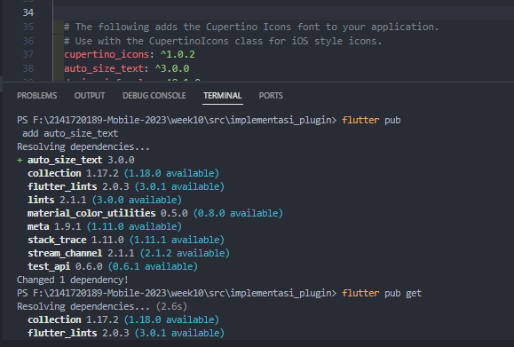
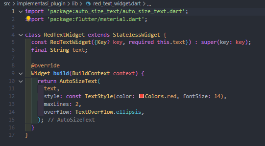
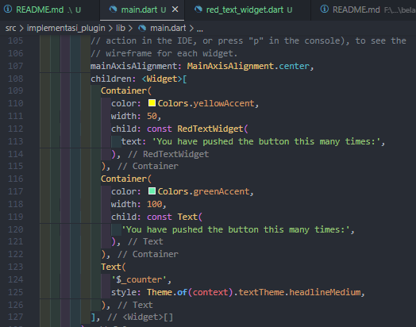
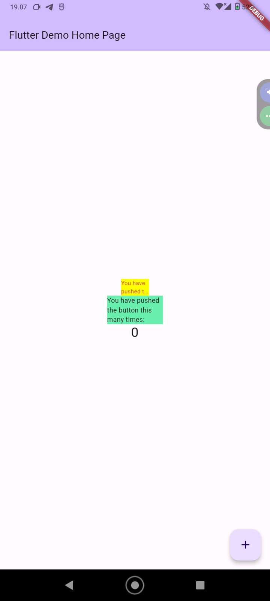

### Nama     : Devi Andini Febrianti
### Kelas    : D4TI-3H
### NIM      : 2141720189
###  Matkul   : Mobile

# Tugas Praktikum

## 1. Selesaikan Praktikum tersebut, lalu dokumentasikan dan push ke repository Anda berupa screenshot hasil pekerjaan beserta penjelasannya di file README.md!

- Menambahkan Plugin

- Membuat file red_text_widget

- Menambahkan widget ke main

- Hasil akhir mobile

## 2. Jelaskan maksud dari langkah 2 pada praktikum tersebut!
- Langkah 2 menambahkan plugin *auto_size_text* dengan cara mengetikkan perintah "flutter pub add auto_size_text" di file pubspec.yaml yang berguna untuk membuat teks yang dapat menyesuaikan ukuran agar sesuai dengan kontennya.

## 3. Jelaskan maksud dari langkah 5 pada praktikum tersebut!

`final String text;`
`cons RedTextWidget({Key? key, required this.text}) : super(key: key);` 

menjelaskan deklasi variabel dan konstruksi dari red_text_widget. Deklarasi `final String text;` sebagai variabel final yang nilainya tidak dapat diubah setelah dideklarasi. Sedangkan `cons RedTextWidget({Key? key, required this.text}) : super(key: key);` mendefinisikan konstruktor untuk menginisialisasi objek dari kelas tertentu.

## 4. Pada langkah 6 terdapat dua widget yang ditambahkan jelaskan fungsi dan perbedaannya!
Tahap ini melibatkan penambahan dua widget di dalam class _MyHomePageState di file main.dart.
- widget 1 memiliki warna dan lebar yang berbeda dengan widget 2.
- Widget 1 menggunakan child RedTextWidget. Sedangkan widget 2 mengggunakan child berupa Teks untuk menampilkan teks.

## 5. Jelaskan maksud dari tiap parameter yang ada di dalam plugin auto_size_text berdasarkan tautan pada dokumentasi ini !
`RedTextWidget` digunakan untuk menampilkan teks dengan menyesuaikan ukuran. Widget `RedTextWidget` memiliki dua parameter yaitu key nilai object widget, teks yang akan ditampilkan. Metode `build()` mengembalikan widget `AutoSizeText` mempunyai beberapa parameter antara lain: 

1. `teks` yang akan ditampilkan.
2. `style` gaua yang akan diterapkan di teks.
3. `maxLines` jumlah baris maksimum yang akan ditampilkan.
4. `overflow` menangani teks yang melebihi batas maksimum.