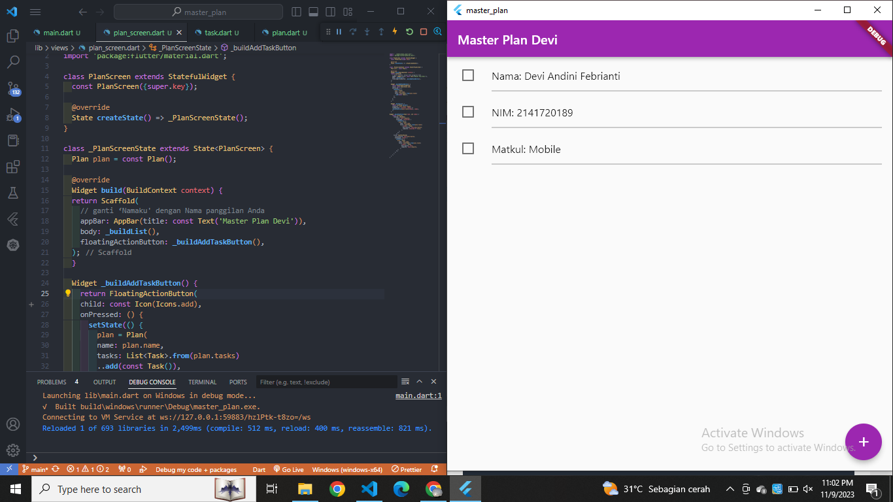
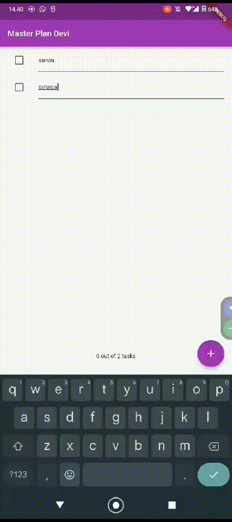
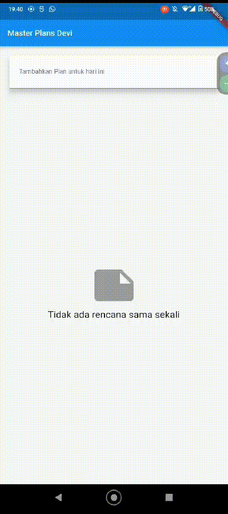

## Nama     : Devi Andini Febrianti
## Kelas    : D4TI-3H
## NIM      : 2141720189
## Matkul   : Mobile

### TUGAS PRAKTIKUM 1: Dasar State dengan Model-View

### 1. Selesaikan langkah-langkah praktikum tersebut, lalu dokumentasikan berupa GIF hasil akhir praktikum beserta penjelasannya di file README.md! Jika Anda menemukan ada yang error atau tidak berjalan dengan baik, silakan diperbaiki.

### 2. Jelaskan maksud dari langkah 4 pada praktikum tersebut! Mengapa dilakukan demikian?

Kode itu mendeklarasikan eksport untuk `plan.dart` dan `task.dart` yang digunakan untuk mengizinkan file lain bisa mengakses kelas, fungsi dan konstanta yang berada di file tersebut. Hal ini membuat file menjadi lebih ringkas.

### 3. Mengapa perlu variabel plan di langkah 6 pada praktikum tersebut? Mengapa dibuat konstanta ?
- Perlu adanya variabel plan karena digunakan untuk menyimpan data yang akan ditampilkan.
- Dibuat konstanta karena setelah pembuatan rencana maka kita tidak bisa mengubahnya kembali

### 4. Lakukan capture hasil dari Langkah 9 berupa GIF, kemudian jelaskan apa yang telah Anda buat!
Didalam praktikum 1 ini, membuat sebuah master plam yang dimana kita bisa menambahkan list plan dan juga bisa menchecklist plan yang menandakan sudah terselesaikan

### 5. Apa kegunaan method pada Langkah 11 dan 13 dalam lifecyle state ?
- Pada langkah 11 `initState()` digunakan untuk membuat objek `ScrollController` yang akan mengontrol scrolling listview. Hal ini digunakan untuk melakukan berbagai hal yang perlu dilakukan sekali, tepat setelah widget dibuat.
- `dispose()` digunakan untuk mengelola gulir widget/kontroler scroll agar tidak menyebabkan memory leak

### TUGAS PRAKTIKUM 2: InheritedWidget

### 1. Selesaikan langkah-langkah praktikum tersebut, lalu dokumentasikan berupa GIF hasil akhir praktikum beserta penjelasannya di file README.md! Jika Anda menemukan ada yang error atau tidak berjalan dengan baik, silakan diperbaiki sesuai dengan tujuan aplikasi tersebut dibuat.

### 2. Jelaskan mana yang dimaksud InheritedWidget pada langkah 1 tersebut! Mengapa yang digunakan InheritedNotifier?

yang merupakan inheritedWidget:
- langkah 1 PlanProvider InheritedNotifier<ValueNotifier<Plan>>. InheritedNotifier merupakan kelas untuk mengakses data dari widet induknya. `valueNotifier` kelas yang digunakan menyimpan nilai dan ini dapat berubah serta akan memberitahu pengguna ketika ada nilai yang berubah

### 3. Jelaskan maksud dari method di langkah 3 pada praktikum tersebut! Mengapa dilakukan demikian?
method `get completedCount()` menghitung jumlah taks yang ada. `get completenessMessage()` menghasilkan pesan yang menunjukan taks tersebut selesai.

### 4. Lakukan capture hasil dari Langkah 9 berupa GIF, kemudian jelaskan apa yang telah Anda buat!

Langkah ini memberikan sebuah notif jumlah task yang dibuat dan jumlah taks yang telah berhasil diselesaikan. Jumlah yang berhasil diselesaikan disesuaikan dengan banyaknya kolom yang terchecklist

### TUGAS PRAKTIKUM 3: State di Multiple Screens

### 1. Selesaikan langkah-langkah praktikum tersebut, lalu dokumentasikan berupa GIF hasil akhir praktikum beserta penjelasannya di file README.md! Jika Anda menemukan ada yang error atau tidak berjalan dengan baik, silakan diperbaiki sesuai dengan tujuan aplikasi tersebut dibuat.

### 2. Berdasarkan Praktikum 3 yang telah Anda lakukan, jelaskan maksud dari gambar diagram berikut ini!

### 3. Lakukan capture hasil dari Langkah 14 berupa GIF, kemudian jelaskan apa yang telah Anda buat!
Praktikum ini membuat `PlanCreatorScreen` untuk menambahkan dan melihat plan apa saya yang telah dibuat