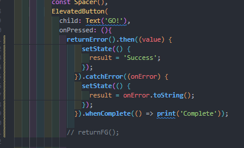
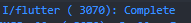
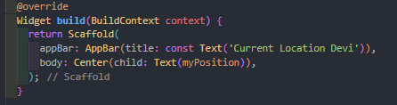
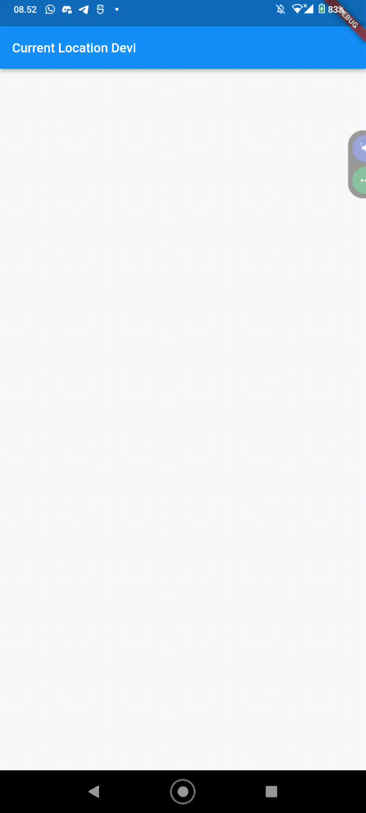
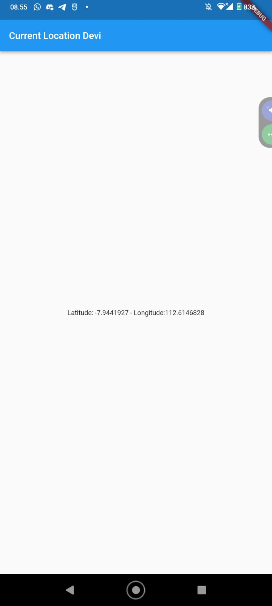
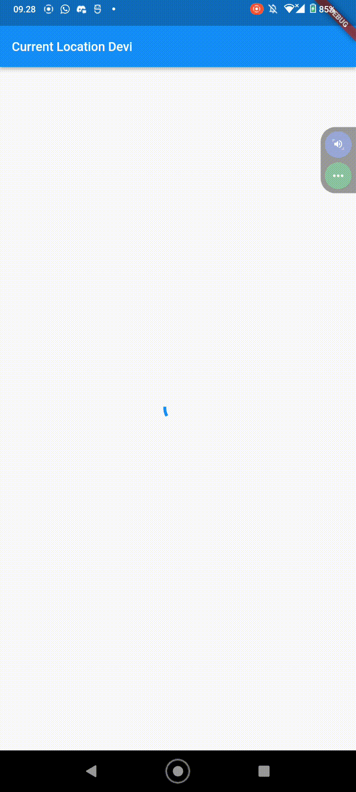
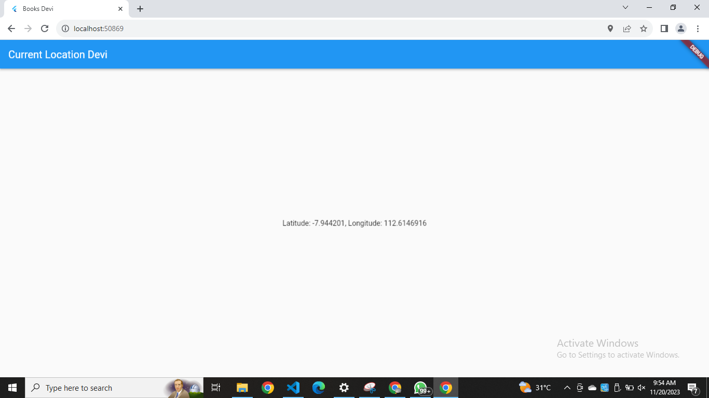
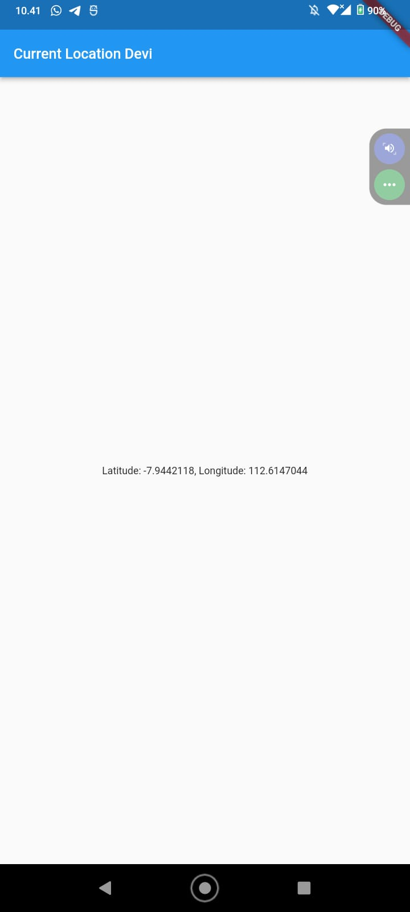

## Nama : Devi Andini Febrianti
## NIM  : 214172189
---------------------------

## Praktikum 1

- Membuat prject baru dengan nama books

- menambahkan plugin http di pubspec
`dependencies:
  flutter:
    sdk: flutter
  http: ^1.1.0`

- Menuju ke main.dart
### Soal 1
Tambahkan nama panggilan Anda pada title app sebagai identitas hasil pekerjaan Anda.

`import 'dart:async';
import 'dart:html';
import 'package:flutter/material.dart';
import 'package:http/http.dart';
import 'package:http/http.dart' as http;

void main(){
  runApp(const MyApp());
}

class MyApp extends StatelessWidget{
  const MyApp({super.key});

  @override
  Widget build(BuildContext context){
    return MaterialApp(
      title: 'Books Devi',
      theme: ThemeData(
        primarySwatch: Colors.blue,
        visualDensity: VisualDensity.adaptivePlatformDensity,
      ),
      home: const FuturePage(),
    );
  }
}

class FuturePage extends StatefulWidget{
  const FuturePage({super.key});

  @override
  State<FuturePage> createState() => _FuturePageState();
}

class _FuturePageState extends State<FuturePage>{
  String result = '';
  @override
  Widget build(BuildContext context){
    return Scaffold(
      appBar: AppBar(
        title: const Text('Devi Andini Febrianti'),
      ),
      body: Center(
        child: Column(children: [
          const Spacer(),
          ElevatedButton(
            child: const Text('GO!'),
            onPressed: (){},
          ),
          const Spacer(),
          Text(result),
          const Spacer(),
          const CircularProgressIndicator(),
          const Spacer(),
        ]),
      ),
    );
  }
}`

- Tambah method getData() kedalam class _FuturePageState ->  menggambil data dari API Google Books.

`Future<Response> getData() async {
    const authority = 'www.googleapis.com';
    const path = '/books/v1/volumes/LCNkBQAAQBAJ';
    Uri url = Uri.https(authority, path);
    return http.get(url);
  }`

### Soal 2
Carilah judul buku favorit Anda di Google Books, lalu ganti ID buku pada variabel path di kode tersebut. Caranya ambil di URL browser Anda seperti gambar berikut ini.

- Akses ke browser

- Tambah kode `onPressed` di `ElevatedButton` sebagai berikut:
`setState(() {});
              getData().then((value) {
                result = value.body.toString().substring(0, 450);
                setState(() {});
              }).catchError((_) {
                result = 'An error occurred';
                setState(() {});
              });`

### Soal 3
- Jelaskan maksud kode langkah 5 tersebut terkait substring dan catchError!

Penjelasan: `substring` untuk mengambil sebagian dari sttring. contohnya `value.body.toString` mengambil sebuah string dari hasil pemanggilan getData() dan hasil variabel di simpan di result. Sedangkan `catchError` untuk menyelesaikan error saat menjalankan fungsi. 

- Capture hasil praktikum Anda berupa GIF dan lampirkan di README. Lalu lakukan commit dengan pesan "W12: Soal 3".

## Praktikum 2: Menggunakan await/async untuk menghindari callbacks
- Tambah dan panggil method count()

## Soal 4 
- Jelaskan maksud kode langkah 1 dan 2 tersebut!

Penjelasan: Kode diatas mempunyai 3 fungsi asinkron dan menunda 3 detik sebelum mengembalikan nilai. sedangkan praktikum 2 memjumlahkan total yang telah dilakukan oleh asinkron yang disimpan di total.

- Capture hasil praktikum Anda berupa GIF dan lampirkan di README. Lalu lakukan commit dengan pesan "W12: Soal 4".

## Praktikum 3: Menggunakan Completer di Future

- tambah variabel di `class _FuturePageState`

- ganti kode di onPressed() menjadi
`getNumber().then((value){`
  `setState((){`
  `result = value.toString();`
  `});`
`});`

## Soal 5
- Jelaskan maksud kode langkah 2 tersebut!

Penjelasan: fungsi `getNumber()` digunakan untuk memulai operasi asinkron dan mengembalikan `future` untuk hasil akhir. `calculate()` melakukan perhitungan asinkron sebenarnya dan menyelesaikan future saat perhitungan selesai. kedua contoh ini digunakan untuk mengambil nilai 42. 

- Capture hasil praktikum Anda berupa GIF dan lampirkan di README. Lalu lakukan commit dengan pesan "W12: Soal 5".

- tambah method calculate2()

- Ganti kode onPressed()

## Soal 6
- Jelaskan maksud perbedaan kode langkah 2 dengan langkah 5-6 tersebut!

perbedaannya hanya berada di cara menangani operasi asinkron saja. langkah 2 menyelesaikan `completer` sekali sesudah melakukan penghitungan 42. sedangkan langkah 5-6 menggunakan `try-catch` untuk memastikan completer cuma dilakukan sekali saja, meskipun beberapa operasi asinkron dipanggil.

- Capture hasil praktikum Anda berupa GIF dan lampirkan di README. Lalu lakukan commit dengan pesan "W12: Soal 6".

## Praktikum 4: Memanggil Future secara paralel

## Soal 7
Capture hasil praktikum Anda berupa GIF dan lampirkan di README. Lalu lakukan commit dengan pesan "W12: Soal 7".

- ganti variabel futureGroup

## Soal 8
Jelaskan maksud perbedaan kode langkah 1 dan 4!

Penjelasan: Langkah 1 menggunakan `FutureGroup` untuk mengelola asinkron, futureGroup menyediakan cara yang terstruktur untuk menangani sekelompok future. langkah 4 menggunakan `Future.wait()`untuk menunggu future dan mengambil daftar future. 

## Praktikum 5: Menangani Respon Error pada Async Code

- menambahkan metdhod di class _FuturePageState

- Mengganti kode elevatedButton

hasil debuge console

## Soal 9
Capture hasil praktikum Anda berupa GIF dan lampirkan di README. Lalu lakukan commit dengan pesan "W12: Soal 9".

## Soal 10
Panggil method handleError() tersebut di ElevatedButton, lalu run. Apa hasilnya? Jelaskan perbedaan kode langkah 1 dan 4!

Penjelasan: Perbedaan kode langkah 1 dan kode langkah 4 adalah pada penanganan error. langkah 1, method returnError() tidak menangani error yang terjadi. Jika error terjadi, maka method tersebut akan berhenti dan tidak mengembalikan nilai apa pun.
Sedangkan pada langkah 4, method handleError() menangani error yang terjadi dengan menggunakan try-catch-finally. Pada try block, method handleError() mencoba untuk menjalankan method returnError(). Jika error terjadi, maka try block akan berhenti dan error akan ditangkap oleh catch block. Pada catch block, method handleError() akan menampilkan error ke layar menggunakan print(). Finally block akan selalu dijalankan, terlepas dari apakah ada error yang terjadi atau tidak.

## Praktikum 6: Menggunakan Future dengan StatefulWidget
- install plugin geolocator

## Soal 11
Tambahkan nama panggilan Anda pada tiap properti title sebagai identitas pekerjaan Anda.

hasil run

## Soal 12
- Jika Anda tidak melihat animasi loading tampil, kemungkinan itu berjalan sangat cepat. Tambahkan delay pada method getPosition() dengan kode await Future.delayed(const Duration(seconds: 3));

- Apakah Anda mendapatkan koordinat GPS ketika run di browser? Mengapa demikian?
>iya mendapatkan koordinat GPS ketika di run, hal ini dikarenakan menggunakaan API Geolocation dari google untuk mendapatkan informasi lokasi. Jika telah mengaktifkan izin lokasi dan GPS maka google akan mendapatkan informasi yang dibutuhkan.

## Praktikum 7: Manajemen Future dengan FutureBuilder

## Soal 13 dan 14
- Apakah ada perbedaan UI dengan praktikum sebelumnya? Mengapa demikian?
> Keduanya sama-sama menampilkan koordinat geolokasi dengan layout yang sama, karena keduanysa sama-sama mengambil lokasi pengguna secara langsung. 

- Seperti yang Anda lihat, menggunakan FutureBuilder lebih efisien, clean, dan reactive dengan Future bersama UI.
> Untuk pembaruan UI, pada kasus pertama, setState digunakan untuk memperbarui variabel state myPosition. Pada kasus kedua, FutureBuilder digunakan untuk mengelola pembaruan UI secara otomatis. Namun pada akhirnya, hasil tampilan UI terlihat sama karena keduanya memiliki penundaan yang sama, yakni 3 detik.

- hasil run 13 dan 14
