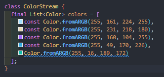
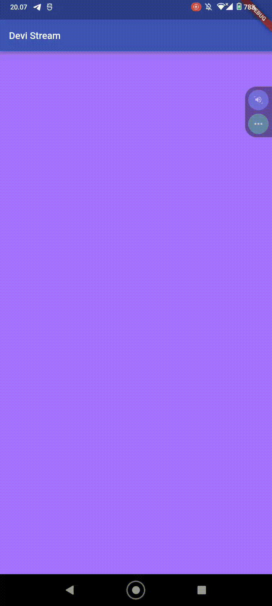
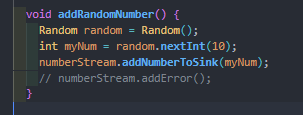
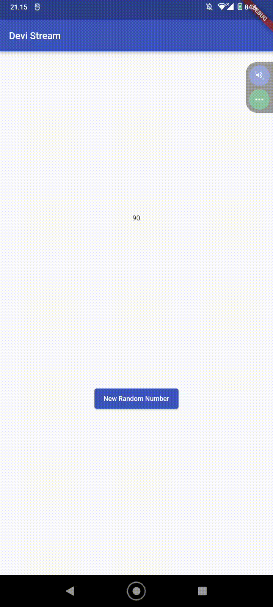

## Nama     : Devi Adini Febrianti
## Nim      : 2141720189
## Kelas    : D4 TI - 3H

### Soal 1

- Tambahkan nama panggilan Anda pada title app sebagai identitas hasil pekerjaan Anda.
- Gantilah warna tema aplikasi sesuai kesukaan Anda.
Lakukan commit hasil jawaban Soal 1 dengan pesan "W13: Jawaban Soal 1"


### Soal 2
- Tambahkan 5 warna lainnya sesuai keinginan Anda pada variabel colors tersebut.
- Lakukan commit hasil jawaban Soal 2 dengan pesan "W13: Jawaban Soal 2"



### Soal 3
- Jelaskan fungsi keyword yield* pada kode tersebut!
> digunakan untuk mendelegasikan pembuatan event dari fungsi Stream.periodic() ke objek iterable colors. hal ini memungkinkan stream untuk lebih efisien tanpa banyak memakan memori di awal. Ini hanya mengeluarkan warna berikutnya saat event sebelumnya telah diproses, memastikan emisi event yang lancar dan konsisten.

### Soal 4
Capture hasil praktikum Anda berupa GIF dan lampirkan di README.



### Soal 5
Jelaskan perbedaan menggunakan listen dan await for (langkah 9) !
> mereka sama-sama dipergunakan untuk menangani operasi asinkron. Penggunaan `listen` memanggil ururtan peristiwa dari waktu ke waktu (secara terarah). sedangkan `await for` mengulang aliran/menunggu peristiwa warna berikut yang akan dikeluarkan (secara beruruan).

## Praktikum 2: Stream controllers dan sinks

### Soal 6
- Jelaskan maksud kode langkah 8 dan 10 tersebut!
> digunakan untuk menginisialiasi `stream` baru yakni `NumberStream`. Sedangkan pada langkah 10 digunakan untuk mengenerate random number lalu menambahkannya ke `stream` menggunakan `sink.add()`.
- Capture hasil praktikum Anda berupa GIF dan lampirkan di README.


### Soal 7
- Jelaskan maksud kode langkah 13 sampai 15 tersebut!
> digunakan untuk mengatasi error pada `stream` dengan menggunakan fungsi `addError()`. Kode `onError()` digunakan untuk menghandle error `stream`. Sedangkan `numberStream.addError()` digunakan untuk menginisialisasi error pada `stream`.
- Kembalikan kode seperti semula pada Langkah 15, comment addError() agar Anda dapat melanjutkan ke praktikum 3 berikutnya.



## Praktikum 3: Injeksi data ke streams

### Soal 8
- Jelaskan maksud kode langkah 1-3 tersebut!
> Maksud dari kode langkah 1-3 digunakan untuk mengubah data.pada kode tersebut `number` akan dikalikan `10` apabila mendapatkan data dan bernilai `-1` apabila terjadi error.
- Capture hasil praktikum Anda berupa GIF dan lampirkan di README.



## Praktikum 4: Subscribe ke stream events

### Soal 9
- Jelaskan maksud kode langkah 2, 6 dan 8 tersebut!
```dart 
 subscription = stream.listen((event) {
      setState(() {
        lastNumber = event;
      });
    });
```
metode `listen()` dipanggil pada objek `stream` untuk mendaftarkan _listener_ yang akan dipanggil setiap kali ada data baru yang tersedia di dalam stream. _Listener_ ini mengambil nilai data (`event`) yang masuk ke dalam stream dan memperbarui `lastNumber` dengan nilai tersebut melalui `setState()`. Dengan mendaftarkan _listener_ ini, kita dapat merespons data yang masuk ke dalam stream.

```dart
    subscription.cancel();
```
jika kita ingin menghentikan penerimaan data dari stream, kita dapat membatalkan _subscription_ dengan memanggil metode `cancel()` pada objek `subscription`. Ini akan menghentikan pemanggilan _listener_ pada stream.

```dart
void addRandomNumber() {
    Random random = Random();
    int myNum = random.nextInt(10);
    if (!numberStreamController.isClosed) {
      numberStream.addNumberToSink(myNum);
    } else {
      setState(() {
        lastNumber = -1;
      });
    }
}
```
menambahkan angka acak ke dalam stream dengan memeriksa keadaan stream. Jika stream telah ditutup, lastNumber diperbarui dengan -1